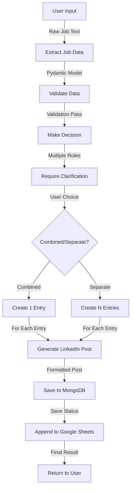

# Link2Hire - AI-Powered LinkedIn Job Processing Tool

A comprehensive, production-ready system for extracting structured job data from unstructured postings using Azure OpenAI, with a modern Angular frontend and robust Python backend.

## 🎯 Project Overview

This tool automates the process of capturing, structuring, and publishing job postings:

1. **User** pastes unstructured job text in a chatbot-style UI
2. **AI extracts** structured data (company, roles, location, etc.)
3. **System detects** multiple roles and asks for clarification
4. **Data is saved** to MongoDB and Google Sheets
5. **LinkedIn post** is auto-generated
6. **User sees** results and can repeat the process

## 🏗️ Architecture

### Tech Stack

| Layer | Technology |
|-------|-----------|
| **Frontend** | Angular 17 + Tailwind CSS |
| **Backend** | Python FastAPI |
| **AI/LLM** | Azure OpenAI (GPT-4) |
| **Database** | MongoDB Atlas |
| **File Tracking** | Google Sheets API |
| **Infrastructure** | Docker (optional) |

### Project Structure

```
link2hire-v1/
├── backend/
│   ├── agent/
│   │   ├── extractor.py         # Extract structured data from raw text
│   │   ├── decision.py          # Determine if clarification needed
│   │   ├── formatter.py         # Generate LinkedIn posts
│   │   ├── validator.py         # Validate job data quality
│   │   └── orchestrator.py      # Coordinate entire workflow
│   ├── services/
│   │   ├── mongodb_service.py   # MongoDB persistence
│   │   ├── sheets_service.py    # Google Sheets integration
│   │   └── linkedin_service.py  # LinkedIn posting (placeholder)
│   ├── models/
│   │   └── job_model.py         # Pydantic models & schemas
│   ├── utils/
│   │   └── helpers.py           # Utility functions
│   ├── config.py                # Environment & settings
│   ├── main.py                  # FastAPI application
│   └── requirements.txt         # Python dependencies
│
├── frontend/
│   ├── src/
│   │   ├── app/
│   │   │   ├── components/chat/
│   │   │   │   ├── chat.component.ts       # Chat logic
│   │   │   │   ├── chat.component.html     # Chat template
│   │   │   │   └── chat.component.css      # Chat styles
│   │   │   ├── services/job.service.ts     # API integration
│   │   │   ├── models/job.model.ts         # TypeScript interfaces
│   │   │   └── app.module.ts               # Root module
│   │   ├── environments/                    # Environment configs
│   │   ├── styles.css                      # Global styles
│   │   └── index.html                      # HTML entry point
│   ├── angular.json                         # Angular config
│   ├── tailwind.config.js                   # Tailwind config
│   └── package.json                         # NPM dependencies
│
├── .env.example                             # Environment template
└── README.md                                # This file
```

## 🚀 Getting Started

### Prerequisites

- **Python 3.11+**
- **Node.js 18+** and npm/yarn
- **MongoDB Atlas** account
- **Azure OpenAI** API access
- **Google Sheets** service account
- **Git**

### Backend Setup

1. **Create virtual environment:**
   ```bash
   cd backend
   python -m venv venv
   
   # Windows
   venv\Scripts\activate
   
   # macOS/Linux
   source venv/bin/activate
   ```

2. **Install dependencies:**
   ```bash
   pip install -r requirements.txt
   ```

3. **Configure environment:**
   ```bash
   cp .env.example .env
   # Edit .env with your credentials
   ```

4. **Create Google Sheets credentials:**
   - Download JSON from Google Cloud Console
   - Save to `backend/credentials/sheets-credentials.json`

5. **Run backend:**
   ```bash
   uvicorn main:app --reload --port 8000
   ```

   Backend will be available at: `http://localhost:8000`

### Frontend Setup

1. **Install dependencies:**
   ```bash
   cd frontend
   npm install
   ```

2. **Configure API URL (optional):**
   - Edit `src/environments/environment.ts`
   - Default is `http://localhost:8000`

3. **Run development server:**
   ```bash
   npm start
   # or
   ng serve
   ```

   Frontend will be available at: `http://localhost:4200`

4. **Build for production:**
   ```bash
   npm run build
   ```

## 📋 API Documentation

### Endpoints

#### 1. **Process Job Posting**
```http
POST /process-job
Content-Type: application/json

{
  "raw_job_text": "TechCorp is hiring Senior Backend Engineer...",
  "user_context": {}
}

Response:
{
  "success": true,
  "message": "Clarification needed before proceeding.",
  "conversation_id": "conv_abc123",
  "state": "awaiting_clarification",
  "requires_clarification": true,
  "clarification_message": "Detected 3 roles. Create combined entry or separate entries?"
}
```

#### 2. **Submit Clarification Response**
```http
POST /clarification-response
Content-Type: application/json

{
  "conversation_id": "conv_abc123",
  "choice": "separate"
}

Response:
{
  "success": true,
  "message": "✅ Successfully processed 3 job entries!",
  "conversation_id": "conv_abc123",
  "state": "completed",
  "job_entries_created": ["job_001", "job_002", "job_003"],
  "linkedin_post": {
    "post_text": "🚀 Exciting opportunity...",
    "hashtags": ["hiring", "techJobs"]
  }
}
```

#### 3. **Get Conversation**
```http
GET /conversation/{conversation_id}

Response:
{
  "conversation_id": "conv_abc123",
  "state": "completed",
  "raw_input": "...",
  "extracted_data": {...},
  "job_entry_ids": ["job_001"]
}
```

#### 4. **Get Jobs by Conversation**
```http
GET /jobs/{conversation_id}

Response:
{
  "conversation_id": "conv_abc123",
  "count": 1,
  "jobs": [...]
}
```

#### 5. **Health Check**
```http
GET /health

Response:
{
  "status": "healthy",
  "timestamp": "2024-03-03T10:00:00",
  "services": {
    "azure_openai": true,
    "mongodb": true,
    "google_sheets": true
  }
}
```

## 🧠 Agent Architecture

### Agent Pattern

Each agent is a specialized component focusing on a single responsibility:

```
User Input
    ↓
[Extraction Agent] → Extract structured data from raw text
    ↓
[Validation Agent] → Check data quality and completeness
    ↓
[Decision Agent]   → Determine if clarification needed
    ↓
    ├─ If clarification needed → Wait for user
    │
    └─ If no clarification → Proceed to execution
        ↓
    [Formatter Agent]    → Generate LinkedIn post
    ↓
    [Services Layer]     → Save to MongoDB & Google Sheets
    ↓
    Response to User
```

### Agent Modules

#### **ExtractorAgent** (`agent/extractor.py`)
- Uses Azure OpenAI with temperature=0 for deterministic output
- Returns strict JSON schema matching `ExtractedJobData` model
- Detects multiple roles in a single posting
- Uses system prompt to enforce format

#### **DecisionAgent** (`agent/decision.py`)
- Analyzes extracted data against business rules
- Determines if > 1 role detected
- Checks for missing required fields
- Returns decision with clarification message

#### **FormatterAgent** (`agent/formatter.py`)
- Generates engaging LinkedIn post content
- Extracts hashtags from generated text
- Fallback to simple template if AI fails
- Uses temperature=0.7 for creative content

#### **ValidationAgent** (`agent/validator.py`)
- Validates URL format and structure
- Checks for placeholder/invalid values
- Calculates data quality score
- Reports validation errors for user review

#### **JobProcessingOrchestrator** (`agent/orchestrator.py`)
- Central coordinator managing entire workflow
- Maintains conversation state in MongoDB
- Coordinates agent execution sequentially
- Handles error recovery and state transitions
- Manages service layer interactions

### Service Layer

#### **MongoDBService** (`services/mongodb_service.py`)
- Async MongoDB operations using Motor
- Manages conversations and job entries
- Creates indexes for performance
- Provides CRUD operations with logging

#### **GoogleSheetsService** (`services/sheets_service.py`)
- Service account authentication
- Appends job entries to tracking spreadsheet
- Updates LinkedIn posting status
- Retrieves historical entries

#### **LinkedInService** (`services/linkedin_service.py`)
- Placeholder for future LinkedIn API integration
- OAuth 2.0 authentication framework
- Post scheduling architecture
- Analytics retrieval interface

## 🔄 Processing Workflow

### Single Job with Clarification Flow



### State Machine

```
INITIAL
  ↓
AWAITING_CLARIFICATION (if multiple roles or missing fields)
  ↓ (user responds)
PROCESSING
  ↓
COMPLETED (success) or ERROR (failure)
```

## 🔐 Security Considerations

1. **No Authentication Required** (Internal Tool)
   - CORS configured to trusted origins
   - Suitable for private deployment only

2. **Environment Variables**
   - All credentials in `.env` file
   - Git ignored (add to `.gitignore`)
   - Service account JSON credentials protected

3. **Input Validation**
   - Pydantic models enforce schema
   - Text sanitization (remove null bytes, trim)
   - URL format validation

4. **Error Handling**
   - Comprehensive exception catching
   - Detailed logging for debugging
   - Safe error responses without sensitive data

## 📊 Database Schema

### Conversations Collection
```python
{
  "_id": ObjectId,
  "conversation_id": str,  # Unique ID
  "state": str,            # INITIAL, AWAITING_CLARIFICATION, PROCESSING, COMPLETED, ERROR
  "raw_input": str,        # Original user input
  "extracted_data": {...}, # ExtractedJobData model
  "decision_output": {...},# DecisionOutput model
  "user_choice": str,      # "combined" or "separate"
  "job_entry_ids": [str],  # List of created job IDs
  "created_at": datetime,
  "updated_at": datetime
}
```

### Jobs Collection
```python
{
  "_id": str,               # Unique job ID
  "conversation_id": str,   # Related conversation
  "raw_input": str,         # Original job text
  "extracted_data": {...},  # ExtractedJobData model
  "linkedin_post": {...},   # LinkedInPost model
  "posted_to_sheets": bool,
  "posted_to_linkedin": bool,
  "created_at": datetime,
  "updated_at": datetime
}
```

## 🧪 Testing

### Test Extraction Agent
```bash
# Use debug endpoint
curl http://localhost:8000/debug/test-extraction?text="Your%20job%20posting%20text"
```

### Test Full workflow
```bash
# 1. Process job
curl -X POST http://localhost:8000/process-job \
  -H "Content-Type: application/json" \
  -d '{"raw_job_text": "..."}'

# 2. Get conversation
curl http://localhost:8000/conversation/{conversation_id}

# 3. Submit clarification
curl -X POST http://localhost:8000/clarification-response \
  -H "Content-Type: application/json" \
  -d '{"conversation_id": "...", "choice": "separate"}'
```

## 🚨 Troubleshooting

### Common Issues

| Issue | Solution |
|-------|----------|
| MongoDB connection fails | Check connection string in `.env`, whitelist IP in Atlas |
| Azure OpenAI returns 401 | Verify API key and endpoint URL in environment |
| Google Sheets append fails | Ensure service account has editor access to spreadsheet |
| CORS errors | Add frontend URL to `API_CORS_ORIGINS` in `.env` |
| Chat not loading | Check that both backend and frontend are running |

### Debug Mode

Enable debug logging:

```python
# In .env
DEBUG=True

# In code
from backend.utils.helpers import setup_logging
setup_logging("DEBUG")
```

## 🔮 Future Enhancements

1. **LinkedIn Integration**
   - OAuth 2.0 implementation
   - Direct API posting
   - Post scheduling
   - Engagement analytics

2. **Advanced Features**
   - RAG (Retrieval Augmented Generation) for context
   - Multi-agent collaboration
   - Job posting history analysis
   - Salary trend analysis

3. **Scaling**
   - Celery task queues
   - Redis caching
   - GraphQL API
   - Webhook support

4. **Analytics**
   - Posting engagement metrics
   - Job source tracking
   - Performance dashboard
   - Export capabilities

## 📚 Dependencies

### Backend (`requirements.txt`)
- `fastapi` - Web framework
- `uvicorn` - ASGI server
- `pydantic` - Data validation
- `motor` - Async MongoDB driver
- `openai` - Azure OpenAI SDK
- `gspread` - Google Sheets API
- `python-dotenv` - Environment variables

### Frontend (`package.json`)
- `@angular/core` - Angular framework
- `@angular/common` - Common utilities
- `@angular/forms` - Form handling
- `tailwindcss` - Utility-first CSS
- `rxjs` - Reactive programming

## 📝 License

[Add your license here]

## 🤝 Contributing

[Add contribution guidelines]

## 📧 Support

For issues and questions, open a GitHub issue or contact the maintainers.

---

**Built with ❤️ for AI-powered job processing**